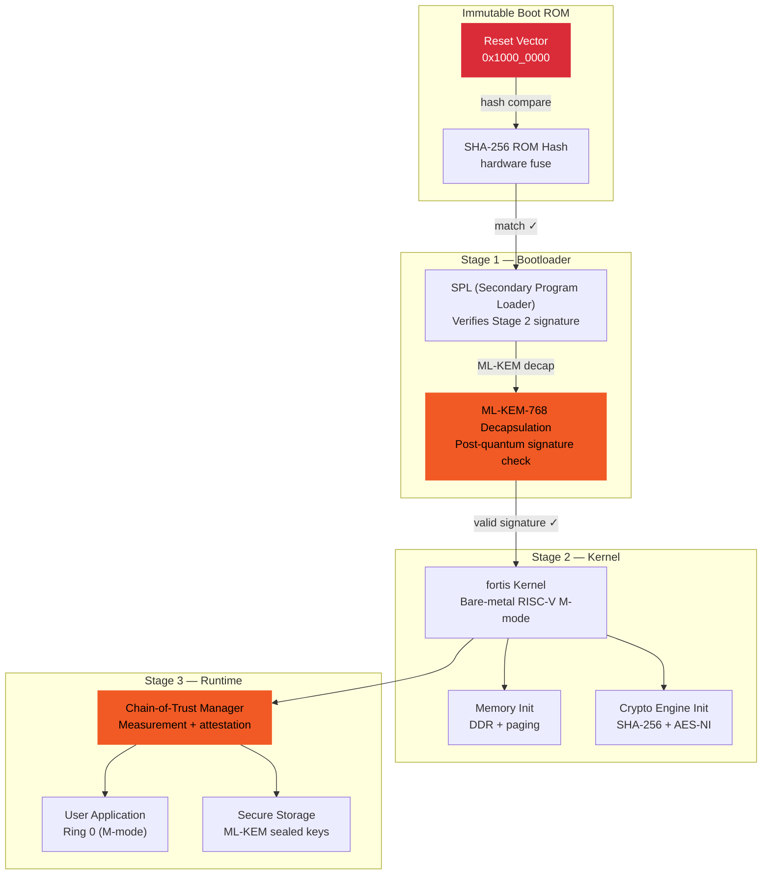
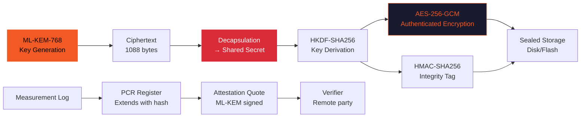
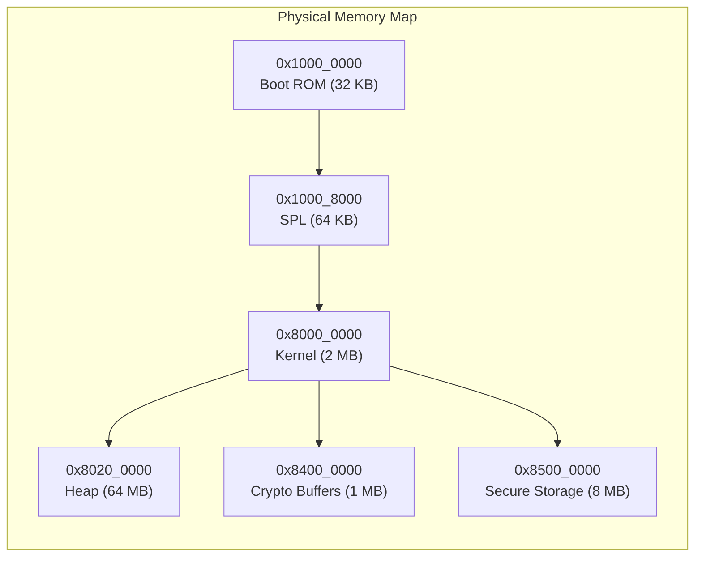

## Architecture

fortis is a **bare-metal RISC-V chain-of-trust** implementing SHA-256 and ML-KEM-768 post-quantum cryptography without an OS. It runs directly on RISC-V hardware (QEMU or real SiFive boards) with a custom boot chain.

### Boot Chain & Trust Model



### Cryptographic Pipeline



### Memory Layout



## Quickstart

### One-liner — QEMU boot (no hardware needed)

```bash
git clone https://github.com/BartoszOsiej/fortis && cd fortis && make qemu
```

### One-liner — Full build (requires riscv64 cross-compiler)

```bash
git clone https://github.com/BartoszOsiej/fortis && cd fortis && \
  export CROSS_COMPILE=riscv64-linux-gnu- && make clean && make -j$(nproc) && \
  qemu-system-riscv64 -machine virt -bios none -kernel build/fortis.bin -nographic
```

### One-liner — Docker (cross-compile environment)

```bash
docker run --rm -v "$(pwd)":/build -w /build \
  ghcr.io/bartoszosiej/riscv-toolchain:latest \
  make -j$(nproc) && \
  qemu-system-riscv64 -machine virt -bios none -kernel build/fortis.bin -nographic
```

### One-liner — Run crypto benchmarks

```bash
cd fortis && make bench && ./build/bench --crypto
```

### Verify

```bash
# After boot, in the fortis shell:
help                    # list commands
crypto-test             # run SHA-256 + ML-KEM-768 self-test
chain verify            # verify boot chain integrity
mem dump 0x80000000 64  # dump first 64 bytes of kernel
```
